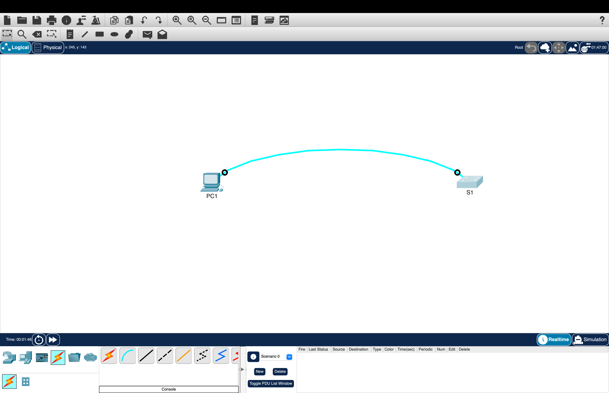
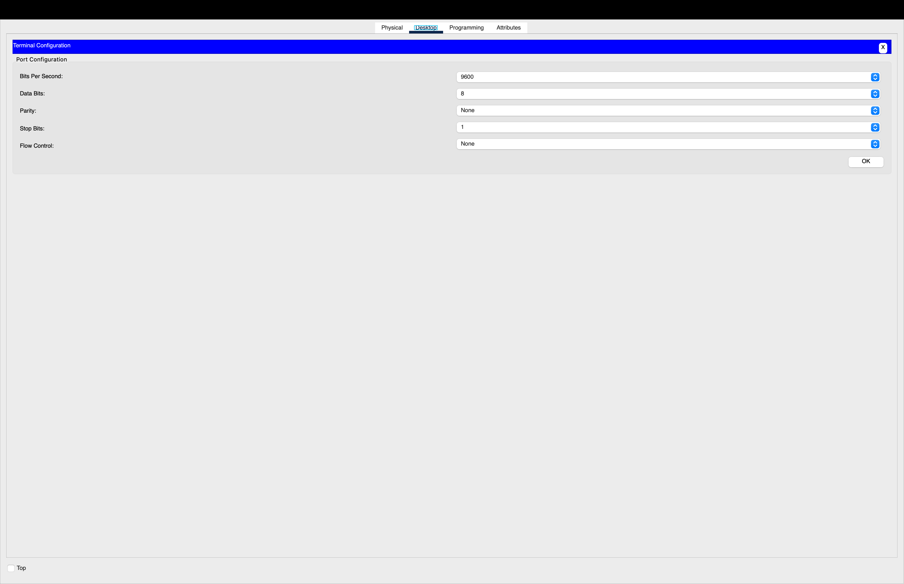
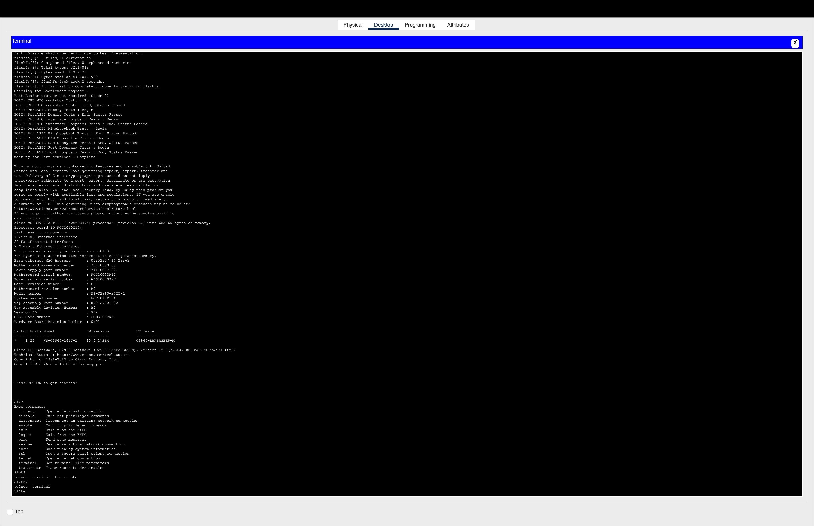
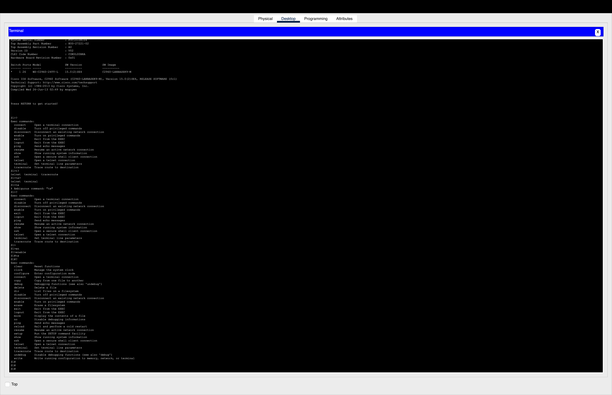
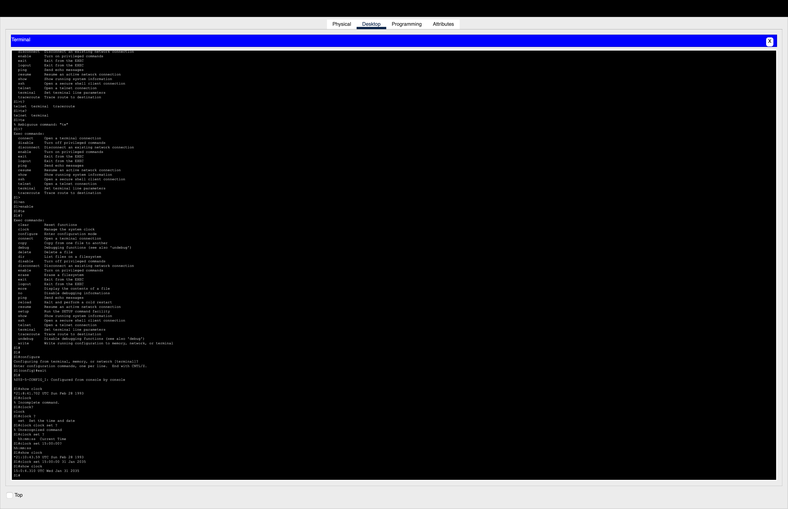

# IOS Navigator — Packet Tracer Mini-Lab 🚀  
*A beginner-friendly Cisco IOS lab covering console connections, CLI navigation, and clock configuration — perfect for networking portfolios.*

---

## 📌 Overview  
This hands-on lab teaches:  
- Connecting **PC1 → S1** via console cable in Cisco Packet Tracer  
- Accessing the CLI and using **context-sensitive help (`?`)**  
- Switching between **User EXEC** and **Privileged EXEC** modes  
- Configuring the device clock with error handling  

---

## 🛠️ Requirements  
- [Cisco Packet Tracer](https://www.netacad.com/courses/packet-tracer)  
- **Topology**:  
  - 1 PC (PC1)  
  - 1 Switch (S1, factory default)  

---

## 🎯 Objectives  
✔ **Establish console connection** with correct terminal settings (9600/8/N/1)  
✔ **Navigate CLI** using `?`, `Tab`, and abbreviated commands  
✔ **Set the system clock** and handle invalid inputs  
✔ **Document outputs** for future reference 

---

## 🔍 Lab Walkthrough  

### 1. Console Connection 
  
*This screenshot shows the Packet Tracer topology with PC1 connected to Switch S1 using a light-blue console cable.*

---

### 2. Terminal Settings (9600/8/N/1/None)
  
*The Terminal Configuration dialog confirms the default serial port settings — Bits per second: 9600, Data bits: 8, Parity: None, Stop bits: 1, Flow control: None.*

---

### 3. Context-Sensitive Help Output
  
*The CLI screen displays the output of Cisco IOS’s context-sensitive help system.*

---

### 4. Privileged EXEC Prompt
  
*CLI prompt changes from `S1>` (user EXEC mode) to `S1#` (privileged EXEC mode).*

---

### 5. Clock Before/After with Error Example
  
*Displays the clock output prior to any changes, followed by the updated time and date after successful configuration. Also includes an IOS error message generated when attempting to set the clock using invalid values.*

---

## How to View the Lab
1. Download the `.pka` file from this repository.  
2. Open it in Cisco Packet Tracer.  
3. Follow the step-by-step lab instructions in the `Navigate_the_IOS.docx` or `.pka` file.

---

## Repository Contents
- **ios-navigator-packet-tracer-lab.pka** — Packet Tracer lab file.  
- **Navigate_the_IOS.docx** — Detailed lab instructions.  
- **images/** — All screenshots used in this README.

---

## License
MIT License.
